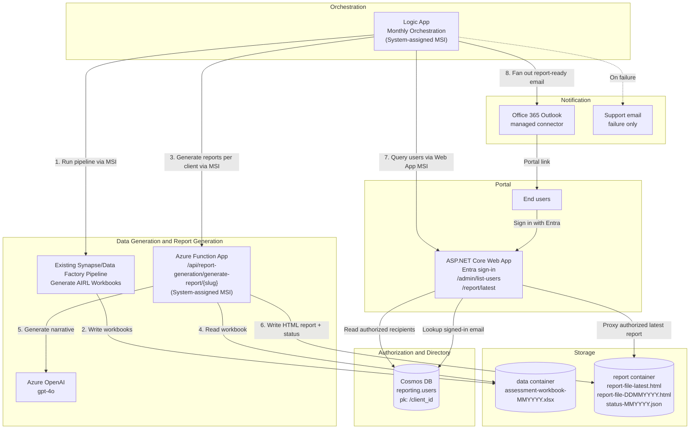

# Simplified Architecture

This repository contains the simplified AIRL Pulse Report monthly flow. It assumes the surrounding Azure infrastructure already exists.

The scope is intentionally smaller than the full end-to-end architecture: it covers orchestration, pipeline start, report generation with Azure OpenAI, writing generated reports to Blob Storage, querying the authorization directory, sending report-ready emails, and serving the portal.



## Component responsibilities

| Component | Responsibility |
|---|---|
| Logic App | Starts the existing data pipeline, waits for completion, then calls the report Function for each configured client slug. |
| Existing pipeline | Generates one AIRL assessment workbook per client and stores it in the `data` container. |
| Azure Function | Reads each workbook, runs the copied AIRL report-generation pipeline, calls Azure OpenAI for narrative generation, renders HTML, and uploads report files. |
| Azure OpenAI | Generates the report narrative used by the AIRL report renderer. |
| Storage `data` container | Holds generated workbook input files. |
| Storage `report` container | Holds generated HTML reports and status manifests. |
| ASP.NET Core Web App | Provides the Entra-protected portal, `/admin/list-users` for Logic App fan-out, and `/report/latest` secure report proxy. |
| Cosmos DB `reporting.users` | Authorization and recipient directory keyed by client slug. |
| Office 365 connector | Sends report-ready email notifications to authorized recipients. |

## Input and output paths

The pipeline must produce:

```text
data/<client-slug>/assessment-workbook-<MMYYYY>.xlsx
```

The Function writes:

```text
report/<client-slug>/report-file-latest.html
report/<client-slug>/report-file-<DDMMYYYY>.html
report/<client-slug>/status-<MMYYYY>.json
```

## Authentication model

- Logic App calls the pipeline using Managed Identity.
- Logic App calls the report Function using Managed Identity.
- Logic App calls the web app `/admin/list-users` endpoint using Managed Identity.
- The report Function validates the Logic App caller using Entra ID token audience and allow-listed principal ID.
- The report Function uses its own Managed Identity to access Blob Storage and Azure OpenAI.
- The web app validates the Logic App caller for `/admin/*` using Entra ID token audience and allow-listed principal ID.
- End users authenticate to the portal with Entra ID.
- The portal maps signed-in user email to Cosmos DB `reporting.users` before streaming a report.

## Web app and portal paths

- `GET /admin/list-users` returns only recipient fan-out fields.
- `GET /` shows the signed-in user's portal landing page.
- `GET /report/latest` streams the signed-in user's latest client report from Blob Storage.
- `GET /Unauthorized` returns 403 when the signed-in user is not in the directory.

## Out of scope for this branch

The branch assumes Azure resource creation, private endpoint topology, Key Vault, App Insights, and Office 365 connection authorization already exist or are managed by the consuming environment.
