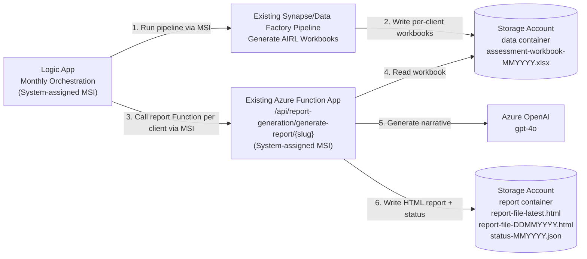

# Simplified Architecture

This repository contains the simplified report-generation portion of the AIRL Pulse Report monthly flow. It assumes the surrounding Azure infrastructure already exists.

The scope is intentionally smaller than the full end-to-end architecture: it covers orchestration, pipeline start, report generation with Azure OpenAI, and writing generated reports to Blob Storage.



## Component responsibilities

| Component | Responsibility |
|---|---|
| Logic App | Starts the existing data pipeline, waits for completion, then calls the report Function for each configured client slug. |
| Existing pipeline | Generates one AIRL assessment workbook per client and stores it in the `data` container. |
| Azure Function | Reads each workbook, runs the copied AIRL report-generation pipeline, calls Azure OpenAI for narrative generation, renders HTML, and uploads report files. |
| Azure OpenAI | Generates the report narrative used by the AIRL report renderer. |
| Storage `data` container | Holds generated workbook input files. |
| Storage `report` container | Holds generated HTML reports and status manifests. |

## Input and output paths

The pipeline must produce:

```text
data/<client-slug>/assessment-workbook-<MMYYYY>.xlsx
```

The Function writes:

```text
report/<client-slug>/report-file-latest.html
report/<client-slug>/report-file-<DDMMYYYY>.html
report/<client-slug>/status-<MMYYYY>.json
```

## Authentication model

- Logic App calls the pipeline using Managed Identity.
- Logic App calls the report Function using Managed Identity.
- The report Function validates the Logic App caller using Entra ID token audience and allow-listed principal ID.
- The report Function uses its own Managed Identity to access Blob Storage and Azure OpenAI.

## Out of scope for this minimal repo

The full architecture also includes a user portal, Authorization & Directory, email fan-out, observability, Key Vault, and private endpoint topology. Those are not included here except where existing infrastructure values are passed into this report-generation flow.

