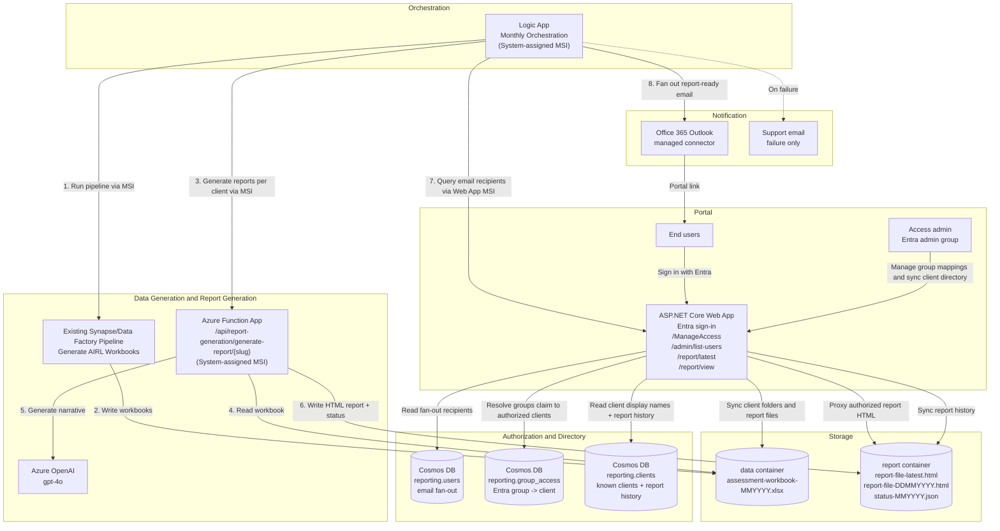

# Simplified Architecture

This repository contains the simplified AIRL Pulse Report monthly flow. It assumes the surrounding Azure infrastructure already exists.

The scope is intentionally smaller than the full end-to-end architecture: it covers orchestration, pipeline start, report generation with Azure OpenAI, writing generated reports to Blob Storage, querying the authorization directory, sending report-ready emails, and serving the Entra-protected portal.


```mermaid
flowchart TB
    subgraph ORCH["Orchestration"]
        LA["Logic App<br/>Monthly Orchestration<br/>(System-assigned MSI)"]
    end

    subgraph DATAFLOW["Data Generation and Report Generation"]
        PIPE["Existing Synapse/Data Factory Pipeline<br/>Generate AIRL Workbooks"]
        FUNC["Azure Function App<br/>/api/report-generation/generate-report/{slug}<br/>(System-assigned MSI)"]
        OAI["Azure OpenAI<br/>gpt-4o"]
    end

    subgraph STORAGE["Storage"]
        DATA[("data container<br/>assessment-workbook-MMYYYY.xlsx")]
        REPORT[("report container<br/>report-file-latest.html<br/>report-file-DDMMYYYY.html<br/>status-MMYYYY.json")]
    end

    subgraph AUTH["Authorization and Directory"]
        USERS[("Cosmos DB<br/>reporting.users<br/>email fan-out")]
        GROUPS[("Cosmos DB<br/>reporting.group_access<br/>Entra group -> client")]
        CLIENTS[("Cosmos DB<br/>reporting.clients<br/>known clients + report history")]
    end

    subgraph PORTAL["Portal"]
        WEB["ASP.NET Core Web App<br/>Entra sign-in<br/>/ManageAccess<br/>/admin/list-users<br/>/report/latest<br/>/report/view"]
        ADMIN["Access admin<br/>Entra admin group"]
        USER["End users"]
    end

    subgraph NOTIFY["Notification"]
        EMAIL["Office 365 Outlook<br/>managed connector"]
        SUPPORT["Support email<br/>failure only"]
    end

    LA -- "1. Run pipeline via MSI" --> PIPE
    PIPE -- "2. Write workbooks" --> DATA
    LA -- "3. Generate reports per client via MSI" --> FUNC
    FUNC -- "4. Read workbook" --> DATA
    FUNC -- "5. Generate narrative" --> OAI
    FUNC -- "6. Write HTML report + status" --> REPORT
    LA -- "7. Query email recipients via Web App MSI" --> WEB
    WEB -- "Read fan-out recipients" --> USERS
    LA -- "8. Fan out report-ready email" --> EMAIL
    EMAIL -- "Portal link" --> USER
    USER -- "Sign in with Entra" --> WEB
    WEB -- "Resolve groups claim to authorized clients" --> GROUPS
    WEB -- "Read client display names + report history" --> CLIENTS
    WEB -- "Proxy authorized report HTML" --> REPORT
    ADMIN -- "Manage group mappings and sync client directory" --> WEB
    WEB -- "Sync client folders and report files" --> DATA
    WEB -- "Sync report history" --> REPORT
    LA -. "On failure" .-> SUPPORT
```

## Component responsibilities

| Component | Responsibility |
|---|---|
| Logic App | Starts the existing data pipeline, waits for completion, then calls the report Function for each configured client slug. |
| Existing pipeline | Generates one AIRL assessment workbook per client and stores it in the `data` container. |
| Azure Function | Reads each workbook, runs the copied AIRL report-generation pipeline, calls Azure OpenAI for narrative generation, renders HTML, and uploads report files. |
| Azure OpenAI | Generates the report narrative used by the AIRL report renderer. |
| Storage `data` container | Holds generated workbook input files. |
| Storage `report` container | Holds generated HTML reports and status manifests. |
| ASP.NET Core Web App | Provides the Entra-protected portal, `/ManageAccess` admin UI, `/admin/list-users` for Logic App fan-out, `/report/latest`, and `/report/view` secure report proxies. |
| Cosmos DB `reporting.users` | Recipient directory used by `/admin/list-users` for report-ready email fan-out. |
| Cosmos DB `reporting.group_access` | Maps Entra security group object IDs to client/company access. |
| Cosmos DB `reporting.clients` | Stores known clients synced from Blob `data` folders and cached report history from Blob `report`. |
| Office 365 connector | Sends report-ready email notifications to authorized recipients. |

## Input and output paths

The pipeline must produce:

```text
data/<client-slug>/assessment-workbook-<MMYYYY>.xlsx
```

The Function writes:

```text
report/<client-slug>/report-file-latest.html
report/<client-slug>/report-file-<DDMMYYYY>.html
report/<client-slug>/status-<MMYYYY>.json
```

## Authentication model

- Logic App calls the pipeline using Managed Identity.
- Logic App calls the report Function using Managed Identity.
- Logic App calls the web app `/admin/list-users` endpoint using Managed Identity.
- The report Function validates the Logic App caller using Entra ID token audience and allow-listed principal ID.
- The report Function uses its own Managed Identity to access Blob Storage and Azure OpenAI.
- The web app validates the Logic App caller for `/admin/*` using Entra ID token audience and allow-listed principal ID.
- End users authenticate to the portal with Entra ID.
- The portal computes accessible clients from the signed-in user's Entra security-group claims and Cosmos DB `reporting.group_access`.
- The portal streams only authorized report files from Blob Storage through server-side managed identity access.

## Web app and portal paths

- `GET /admin/list-users` returns only recipient fan-out fields.
- `GET /` shows a signed-in user's authorized companies and report history.
- `GET /ManageAccess` lets members of `Admin__AdminGroupId` manage group-to-client mappings and sync the client directory from storage.
- `GET /report/latest?client=<client-id>` streams the selected authorized client's latest report.
- `GET /report/view?client=<client-id>&name=<report-file-DDMMYYYY.html>` streams a selected authorized report file.
- `GET /Unauthorized` returns 403 when the signed-in user has no mapped client access.

## Out of scope for this branch

The branch assumes Azure resource creation, private endpoint topology, Key Vault, App Insights, and Office 365 connection authorization already exist or are managed by the consuming environment.
